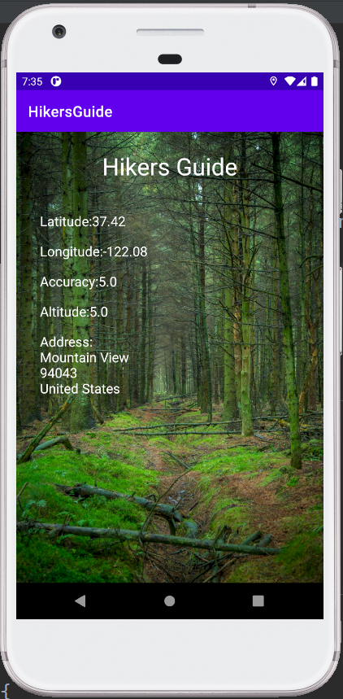

# HikersGuide
App displaying lolization info.
App background image is from publicdomainpictures.net

<h3>User can check:</h3>

- longitude,
- latitude,
- accuracy,
- attitude,
- address.

<h3>Used technologies:</h3>

- kotlin,
- asking for permissions,
- google location services,
- finding views from layout with view binding.

<h3>App screen during usage:</h3>

App main screen    |       
:-------------------------:
   |
